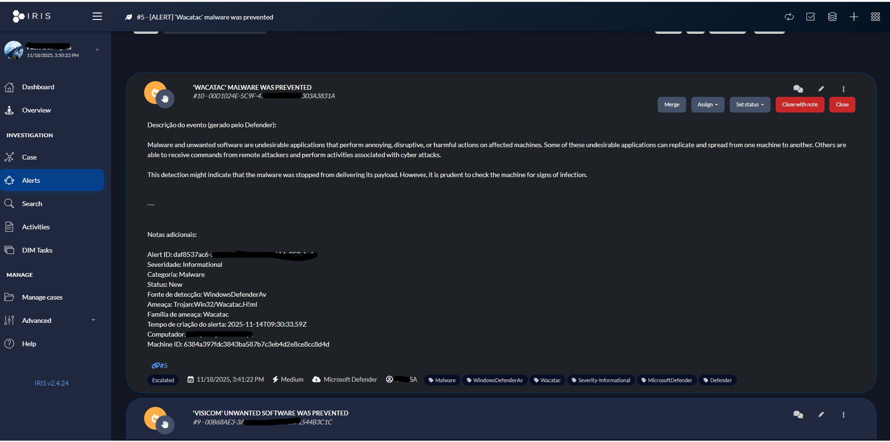
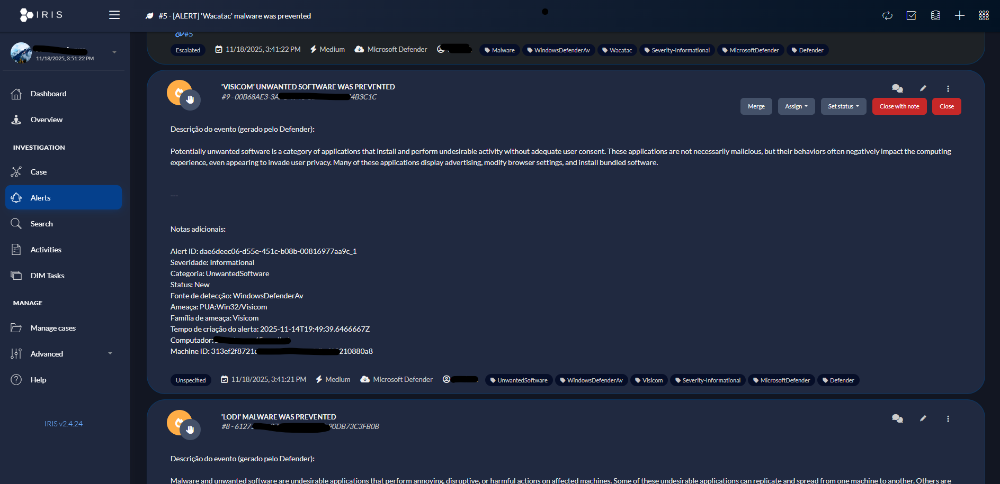
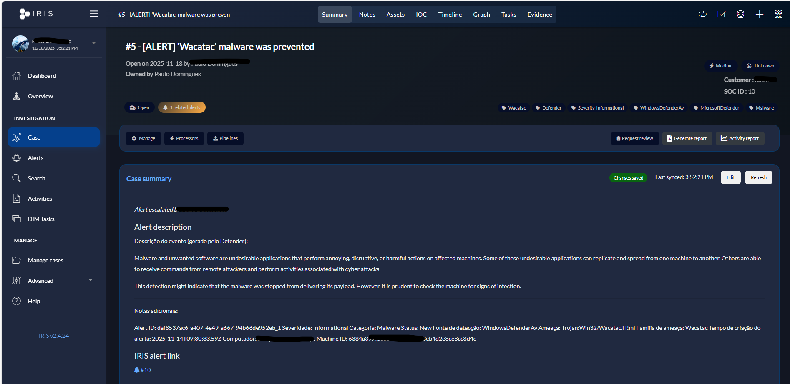
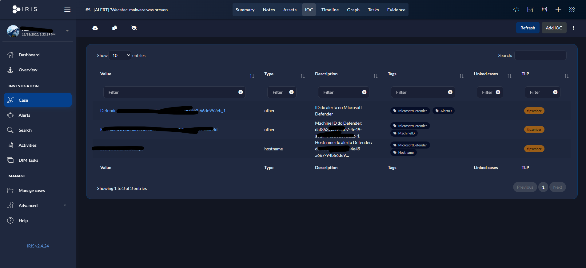

# Microsoft Defender to IRIS Integration

A Python script that automatically synchronizes alerts from Microsoft Defender for Endpoint to IRIS (Incident Response & Intelligence System), streamlining your security operations workflow.


## 📋 Table of Contents

- [Overview](#overview)
- [Features](#features)
- [Prerequisites](#prerequisites)
- [Installation](#installation)
- [Configuration](#configuration)
- [Usage](#usage)
- [Screenshots](#screenshots)
- [How It Works](#how-it-works)
- [Troubleshooting](#troubleshooting)
- [Contributing](#contributing)
- [License](#license)

## 🎯 Overview

This integration tool fetches alerts with status "New" from Microsoft Defender for Endpoint and automatically creates corresponding alerts in your IRIS instance. It preserves all relevant information including:

- Alert details and descriptions
- Severity levels
- MITRE ATT&CK techniques
- IOCs (Indicators of Compromise)
- Alert timeline and story
- Asset information
- Recommended actions

## ✨ Features

- **Automatic Alert Synchronization**: Fetches new alerts from Microsoft Defender and creates them in IRIS
- **Rich Data Mapping**: Maps Defender alert fields to IRIS alert structure
- **IOC Extraction**: Automatically extracts and creates IOCs (hostnames, IPs, machine IDs, etc.)
- **MITRE ATT&CK Support**: Captures and preserves MITRE ATT&CK technique information
- **Smart Customer Detection**: Automatically finds available customer IDs if permissions fail
- **Colored Terminal Output**: Easy-to-read console output with color-coded status messages
- **Error Handling**: Robust error handling with detailed error messages
- **Story Timeline**: Fetches and includes alert story timeline when available

## 📦 Prerequisites

- Python 3.7 or higher
- Microsoft Defender for Endpoint API access
- IRIS instance with API access
- Microsoft Azure App Registration with the following permissions:
  - `SecurityEvents.Read.All` (Microsoft Graph API)
  - Or appropriate Microsoft Defender API permissions

## 🚀 Installation

1. **Clone the repository:**
   ```bash
   git clone https://github.com/yourusername/defender-to-iris.git
   cd defender-to-iris
   ```

2. **Install required dependencies:**
   ```bash
   pip install requests urllib3
   ```

## ⚙️ Configuration

Edit the `defender_to_iris.py` file and configure the following variables:

### Microsoft Defender Configuration

```python
tenant_id = 'YOUR_TENANT_ID_HERE'
app_id = 'YOUR_APP_ID_HERE'
app_secret = 'YOUR_APP_SECRET_HERE'
```

**To get these values:**
1. Go to [Azure Portal](https://portal.azure.com)
2. Navigate to **Azure Active Directory** > **App registrations**
3. Create a new app registration or use an existing one
4. Copy the **Application (client) ID** → `app_id`
5. Copy the **Directory (tenant) ID** → `tenant_id`
6. Create a new client secret → `app_secret`
7. Grant the app the required Microsoft Defender API permissions

### IRIS Configuration

```python
IRIS_BASE_URL = "https://YOUR_IRIS_HOST_HERE"
IRIS_API_KEY = "YOUR_IRIS_API_KEY_HERE"
IRIS_DEFAULT_CUSTOMER_ID = 2  # Adjust according to your environment
IRIS_DEFAULT_ALERT_STATUS_ID = 1  # Usually 1 = New
IRIS_DEFAULT_CASE_ID = None  # Set to a case ID if you want alerts linked to a case
```

**To get IRIS API key:**
1. Log in to your IRIS instance
2. Navigate to your user profile settings
3. Generate or copy your API key

## 💻 Usage

Run the script:

```bash
python defender_to_iris.py
```

The script will:
1. Authenticate with Microsoft Defender
2. Fetch all alerts with status "New"
3. Create corresponding alerts in IRIS
4. Display a summary of processed alerts

### Example Output

```
======================================================================
Microsoft Defender -> IRIS Integration
======================================================================

[INFO] Usando Customer ID: 2
[1/3] Autenticando no Microsoft Defender...
[OK] Autenticação bem-sucedida!

[2/3] Buscando alertas 'New' no Microsoft Defender...
[OK] Encontrados 5 alerta(s) com status 'New'

[3/3] Criando alertas no IRIS...

[1/5] Processando alerta:
  ID: abc123-def456-ghi789
  Título: Suspicious PowerShell execution detected
  Severidade: High
  Categoria: Execution
  [OK] Alerta criado no IRIS! ID: 42

======================================================================
Resumo:
  Total de alertas processados: 5
  Alertas criados no IRIS: 5
  Falhas: 0
======================================================================
```

## 📸 Screenshots

### Microsoft Defender Alert View



### Alert Details in Defender



### Alert Timeline



### IRIS Alert Creation


### Alert Processing



### Success Notification


### Complete Workflow


## 🔧 How It Works

1. **Authentication**: The script authenticates with Microsoft Defender using OAuth 2.0 client credentials flow
2. **Alert Fetching**: Queries the Microsoft Defender API for alerts with status "New"
3. **Data Enrichment**: Fetches full alert details including story timeline and MITRE techniques
4. **Data Mapping**: Maps Defender alert fields to IRIS alert structure:
   - Title → `alert_title`
   - Description → `alert_description` (formatted with recommended actions)
   - Severity → `alert_severity_id` (mapped: Informational/Low=1, Medium=2, High=3, Critical=4)
   - IOCs → `alert_iocs` (hostnames, machine IDs, alert IDs)
   - Assets → `alert_assets` (affected computers)
5. **Alert Creation**: Creates the alert in IRIS via API
6. **Error Handling**: If customer permission fails, automatically tries to find an available customer

## 🐛 Troubleshooting

### Authentication Errors

**Error**: `[ERRO] Erro na autenticação`

**Solutions**:
- Verify your `tenant_id`, `app_id`, and `app_secret` are correct
- Ensure the app has the required Microsoft Defender API permissions
- Check that the client secret hasn't expired

### Customer Permission Errors

**Error**: `not entitled to create alerts for the client`

**Solutions**:
- The script will automatically try to find an available customer
- Manually set `IRIS_DEFAULT_CUSTOMER_ID` to a customer ID you have access to
- Check your IRIS user permissions

### Connection Errors

**Error**: `Erro de conexão` or `Timeout`

**Solutions**:
- Verify `IRIS_BASE_URL` is correct and accessible
- Check firewall rules and network connectivity
- Ensure the IRIS API endpoint is reachable

### No Alerts Found

**Message**: `Nenhum alerta 'New' encontrado`

**Solutions**:
- This is normal if there are no new alerts in Defender
- Verify alerts exist in Microsoft Defender portal
- Check alert status filters

## 🤝 Contributing

Contributions are welcome! Please feel free to submit a Pull Request. For major changes, please open an issue first to discuss what you would like to change.

1. Fork the repository
2. Create your feature branch (`git checkout -b feature/AmazingFeature`)
3. Commit your changes (`git commit -m 'Add some AmazingFeature'`)
4. Push to the branch (`git push origin feature/AmazingFeature`)
5. Open a Pull Request

## 📝 License

This project is licensed under the MIT License - see the LICENSE file for details.

## 🙏 Acknowledgments

- [Microsoft Defender for Endpoint](https://docs.microsoft.com/en-us/microsoft-365/security/defender-endpoint/)
- [IRIS - Incident Response & Intelligence System](https://docs.dfir-iris.org/)
- Python community for excellent libraries

## 📞 Support

If you encounter any issues or have questions, please open an issue on GitHub.

---

**Note**: Make sure to keep your credentials secure. Never commit sensitive information to version control. Consider using environment variables or a configuration file that's excluded from git.

